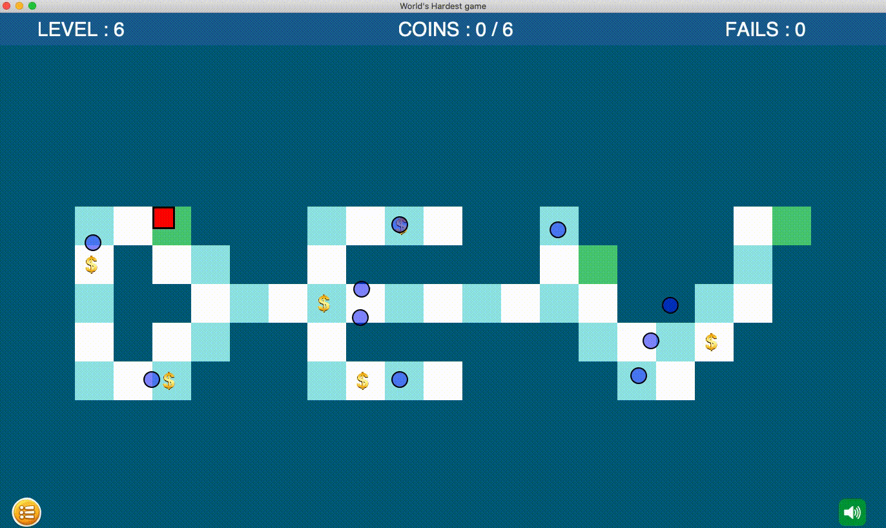

### C# implementation of the [World's Hardest Game](https://www.coolmathgames.com/0-worlds-hardest-game)

### Level 6 gameplay:



### MacOs :

Before building the project, make sure you download and install [Mono](https://www.mono-project.com/download/stable/)

##### Building and playing the game :
```console
devyanshu@10:~$ chmod +x play_mac.sh && ./play_mac.sh
```
This creates a 'game.exe' file which you can later run using Mono without having to build the project again
```console
devyanshu@10:~$ mono game.exe
```
good one. i like very much.
